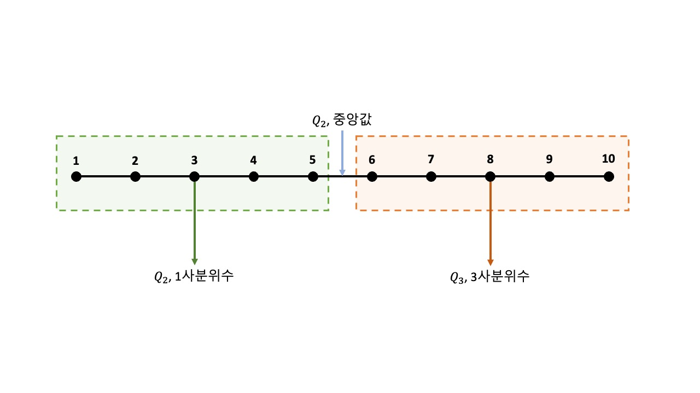

# IQR 
\* 최대한 이해하기 쉽게 설명하려다 보니 실제 정의와 차이가 있을 수 있음  
\* **'->'** 로 표시한 내용이 주관대로 해석한 내용

(작성중)

> 정의 
> - 
> $$ IQR = Q_3 - Q_1 $$
> - 사분위수 범위 (Interquartile Range)  
> - 중앙값에서 부터 데이터들이 흩어진 정도

> 사용목적 
> - 
> - 이상치 구분

> 이상치 구분 방법
> - 
> - 하한 이상치 : $Q_1$ - $IQR$ * 1.5 이하
> - 상한 이상치 : $Q_3$ + $IQR$ * 1.5 이상

> IQR 계수 1.5 의 의미
> - 
> - 가장 의미있는 값을 뽑기위한 최적의 값이 1.5이기 때문

> 의미있는 값
> - 
> - 정의
>   - 신뢰수준 95% 이상의 값 (적다보면 수정될 것 같음)
> - 신뢰수준
>   - 신뢰수준이 95% : 의미있는 $n$개의 표본을 사용하여 신뢰구간을 구하는 과정을 100회 반복했을 때, 그 중 95개는 실제 모수를 포함  
>   - 추정하는 구간의 폭이 넓어질 수록 신뢰도가 높아지고, 추정 구간의 폭이 좁아질 수록 신뢰도가 감소한다  
>   - 1 - $\alpha$ 로 표현됨 (신뢰수준이 95%라면 $\alpha$는 0.05)  
>   -> 수집하고자 하는 모든 데이터를 현실적으로 수집하기 어려울때 (예 - 전 가구의 실시간 TV 시청 채널) 전체 데이터 중 믿을 수 있는 데이터만 일부 사용해서 **'전체 데이터는 이렇게 생겼을 것이다'** 라고 유추를 한다. 이때 유추하는 과정에서 나온 <U>'결과를 실제 값과 비교했을 때, 100번 중 95번은 맞더라'</U> 라는 내용이 '신뢰수준이 95%다' 라는 내용.  
>   -> 그만큼 **결과가 믿을만 하다 라는 정도를 수치로 표현**한 내용  
>   -> '시청률이 15%다!' 라고 콕 집어서 말하는 것 보다 '시청률은 10~20% 사이 정도다' 라고 말하는 것이 신뢰도는 더 높다
> - 신뢰구간
>   - 모평균이 들어와 있을 만한 구간
>   -> <U>'차타고 한 10분이면 간다'</U> 같이 결론을 내린 대략적인 값의 범위

> 용어 정의
> -
> - 모집단
>   - 내가 정보를 얻고싶은 대상의 <U>**모**든 **집단**</U>  
>   -> 모든 데이터
> - 모평균
>   - 모집단의 평균 ($\mu$ [mu:뮤])  
>   -> 모든 데이터의 평균
> - 표본 평균
>   - 일부 추출한 표본들의 평균 ($\bar{X}$)
> - 표본 분산
>   - 표본들의 분산 ($\sigma^2$ [sigma:시그마])  
>   -> 표본들이 평균으로 부터 흩어져있는 정도

> 사분위수
> - 
> 
