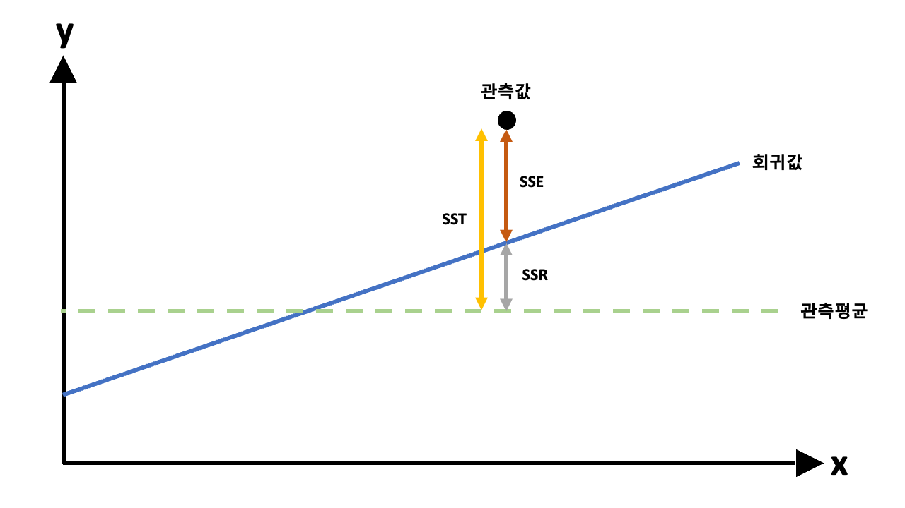

# 회귀분석 (Regression Analysis)
> 정의
- 한개 이상의 독립변수들이 종속변수에 미치는 영향을 추정할 수 있는 통계기법  
-> 결과는 이미 있고 (관측값, 종속변수), 내가 생각했을 때 이게 (독립변수) 조금 관측값이 변하는 원인으로 작용하지 않을까 하는 내용을 검증해서 확인해보고, 예상이 맞으면 미래 예측까지 할 수 있는 과정

> 사용 변수
> -
> - 영향을 받는 변수 (y, 내가 원하는 결과값)
>   - 종속변수, 결과변수, 반응변수
> - 영향을 주는 변수 (x, 영향을 줄거라 의심이 드는 변수)
>   - 독립변수, 예측변수, 설명변수

> 회귀분석 종류
> -
> - 선형회귀
> - 로지스틱 회귀
> - 리지 회귀
> - 라쏘 회귀
> - 다항 회귀  
> -> [참고링크](https://www.appier.com/ko-kr/blog/5-types-of-regression-analysis-and-when-to-use-them)

회귀분석에도 여러 종류가 있지만 우선적으로 선형회귀에 대한 내용을 정리해본다.

> 선형회귀분석의 가정
> -
> 선형회귀(x가 1개) 로써 만족해야 하는 조건(기본가정)은 아래와 같다
> - 선형성
>   - 입력변수와 출력변수의 관계가 선형이어야 한다  
>   -> 곡선 $\not=$ 직선
> - 등분산성
>   - 잔차가 일정하다 (여기서 분산은 잔차의 분산)
>   - 잔차 = 관측치 - 예상치
>   - 이와 관련해서도 좋은 예시가 있어 글을 가져왔다
>    - 출처 : [러닝머신의 Train Data Set](https://blog.naver.com/PostView.nhn?blogId=nilsine11202&logNo=221590077004&parentCategoryNo=&categoryNo=29&viewDate=&isShowPopularPosts=false&from=postView)
>   - 아래가 등분산성을 만족하는 경우
>   - 위는 뒤로갈수록 잔차가 커지는 경향을 보임
> - 독립성
>   - 독립변수들 간에 특정한 관계가 없음
>   - 예) 풍향과 풍력발전기의 전력 발전량은 큰 관계가 있음. 이걸 모형이 학습하게 되면 상대적으로 호율이 떨어질 것. 오히려 성능이 저하될 가능성도 존재함
> - 비상관성
>   - 오차들끼리 상관이 없다
>   - ADsP에만 나오는 개념으로 보임
> - 정상성(정규성)
>   - 잔차가 정규분포를 따름

> 선형회귀 수식
> -
> $$y_i = \beta_0 + \beta_1x_i + \epsilon_i, i=1,2,...,n, \epsilon_i ~ N(0,\sigma^2)$$
> $y_i$ : $i$번째 종속변수 값  
> $x_i$ : $i$번째 독립변수 값  
> $\beta_0$선형 회귀식의 절편  
> $\beta_1$ : 선형 회귀식의 기울기  
> $\epsilon_i$ : 오차항 (정규분포를 따름)

> 회귀계수 ($\beta_0, \beta_1$ 추정)
> -
> - 최소제곱법
>   - <U>오차의 제곱의 합이 **최소**가 되는 값 찾는 과정</U>
>   - $Min S^2 = Min \Sigma^n_{i=1}{\epsilon^2} = Min \Sigma^n_{i=1}{(y_i - b_0 - b_1x_i)^2}$
>   - $y_i = \beta_0 + \beta_1x_i + \epsilon_i$ 수식에서 오차 $\epsilon_i$ 를 구하기 위해 수식을 이항시키면 아래와 같다
>   - $\epsilon_i = y_i - \beta_0 - \beta_1x_i$
>   - 이때 $\beta_1$ 이 0이면 $x$에 아무런 값이나 들어가도 식이 성립할 수 있기때문에 $x$와 $y$ 사이에는 아무런 인과관계가 없다. 따라서 적합된 추정식은 아무 의미가 없게 된다.

> 추정된 값 ($\beta_0, \beta_1$) 검증 방법
> -
> - t-test를 통한 p-value
>   - p-value <= 0.05
> - 결정계수 ($R^2$)
>   - 정의 : 독립변수가 종속변수를 얼마나 설명하는지를 나타낸 지표 (추정된 회귀식이 얼마나 타당한가)
>   - **1에 가까울 수록 회귀모형이 자료를 잘 설명**한다고 한다  
>   (예) R^2 = 0.6  
>   -> 설명률이 60%정도 된다  
>   -> 신뢰가능한 정도로 보는 기준은 없음. 상황에 따라 다르게 적용

> 결정계수
> -
> - 전체제곱합 (Total Sum of Squares, SST) : $\Sigma^n_{i=1}(y_i-\bar{y})^2$
>   - $(관측값 - 관측값 평균)^2$
>   - 예측 전 계산할 수 있는 값
> - 회귀제곱합 (Regressino Sum of Squares, SSR) : $\Sigma^n_{i=1}(\hat{y_i}-\bar{y})^2$
>   - $(예측값 - 관측값 평균)^2$
> - 오차제곱합 (Error Sum of Squares, SSE) : $\Sigma^n_{i=1}({y_i}-\hat{y})^2$
>   - 우리가 일반적으로 이해하는 에러, 잔차
> - 결정계수($R^2$) : 회귀제곱합 / 전체제곱합 ($SSR/SST$) [0,1]
>   - $SSR = SST - SSE$
>   
> - 주의사항